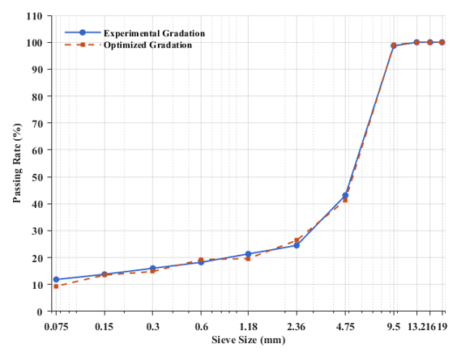
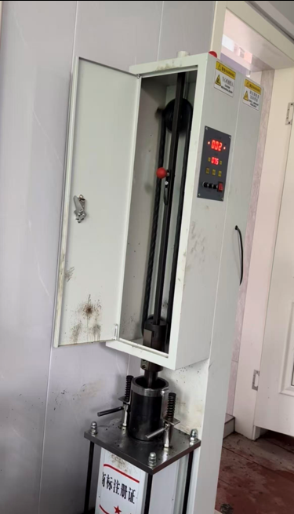
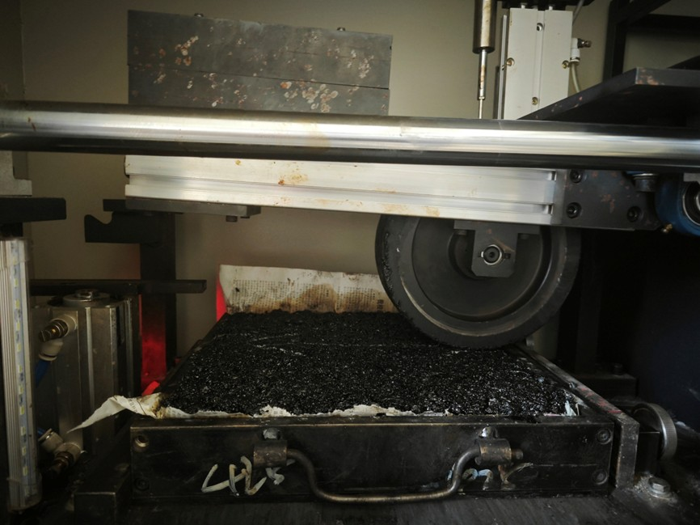
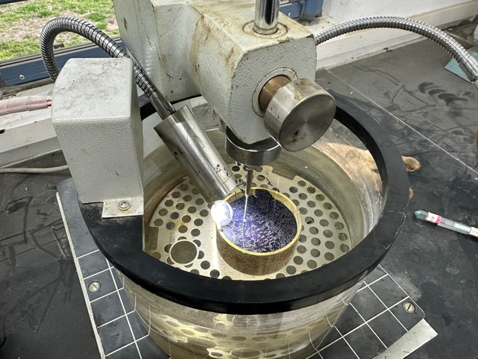
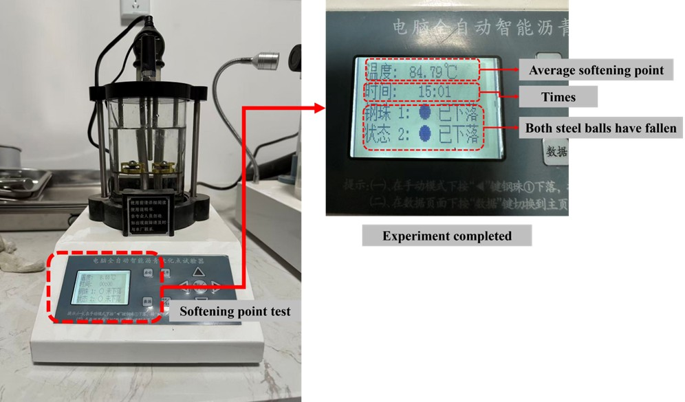

# AC-HP-P-DO

Repository for the study **“Data-driven Efficient Prediction and Design Optimization for High-temperature Performance of Asphalt Mixture”**.

This GitHub project provides the core materials developed in this research, including the dataset, supplementary verification materials, the ACDOS software installer, and usage examples. It is intended to support result transparency, reproducibility, and future research and development.

---

## Table of Contents

* [1. Research Dataset (`Database.xlsx`)](#part1)
* [2. Additional Verification Materials (Case 1 and Case 2)](#part2)
* [3. ACDOS Software (`ACDOS_V1.mlappinstall`)](#part3)
* [4. ACDOS Use-Case Demonstration](#part4)

---

<a id="part1"></a>

## 1. Research Dataset (`Database.xlsx`)

The file [`Database.xlsx`](./Database.xlsx) contains the dataset used in the paper.

### Contents

The database covers the main material descriptors and target performance data used for model development, including:

* asphalt binder properties,
* aggregate gradation data,
* derived gradation descriptors,
* volumetric characteristics, 
* dynamic stability (DS).

After feature screening and engineering, the final modeling framework in the paper was established on a 21-dimensional feature set.

### Purpose

This dataset can be used for:

* reproducing the prediction and optimization workflow reported in the paper,
* testing alternative machine-learning models,
* extending feature engineering studies, and
* updating the ACDOS platform in future work.

---

<a id="part2"></a>

## 2. Additional Verification Materials (Case 1 and Case 2)

To strengthen the experimental validation beyond the main case reported in the paper, two additional mixture-design assistance scenarios were conducted. The full validation process, including optimization targets, Bayesian optimization (BO) outputs, laboratory preparation, and verification test results, is summarized below.

### 2.1 Case 1: SMA-10 Asphalt Mixture Design Assistance

#### 2.1.1 Target

Using a specific 90# base asphalt, this case assists the design of an SMA-10 gradation mixture to achieve a target dynamic stability (DS) of **4200 times/mm**. The features optimized in this case include the **oil-stone ratio**, **gradation**, and **volumetric parameters**.

#### 2.1.2 BO Setup and Results

The upper and lower bounds of the sieve passing rates were set according to the SMA-10 gradation limits in the *Technical Specifications for Construction of Highway Asphalt Pavements (JTG F40-2004)*.

**Table 1. SMA-10 aggregate gradation range**

| Sieve (mm) |  16 | 13.2 | 9.5 | 4.75 | 2.36 | 1.18 | 0.6 | 0.3 | 0.15 | 0.075 |
| ---------- | --: | ---: | --: | ---: | ---: | ---: | --: | --: | ---: | ----: |
| Upper      | 100 |  100 |  100 |   60 |   32 |   26 |  22 |  18 |   16 |   13 |
| Lower      | 100 |  100 |  90  |   28 |   20 |   14 |  12 |  10 |    9 |    8 |

**Table 2. BO results for Case 1 (SMA-10)**

**Restricted parameters**

| Qualified feature     | Value |
| --------------------- | ----: |
| Penetration (0.1 mm)  |    94 |
| Softening Point (°C)  |    65 |
| 19 mm Pass Rate (%)   |   100 |
| 16 mm Pass Rate (%)   |   100 |
| 13.2 mm Pass Rate (%) |   100 |

**Optimized results obtained from BO**

| Optimized feature      |   Value |
| ---------------------- | ------: |
| Oil-stone ratio (%)    |    5.62 |
| 9.5 mm Pass Rate (%)   |   99.04 |
| 4.75 mm Pass Rate (%)  |   41.30 |
| 2.36 mm Pass Rate (%)  |   26.39 |
| 1.18 mm Pass Rate (%)  |   19.61 |
| 0.6 mm Pass Rate (%)   |   19.26 |
| 0.3 mm Pass Rate (%)   |   14.82 |
| 0.15 mm Pass Rate (%)  |   13.49 |
| 0.075 mm Pass Rate (%) |    9.37 |
| VV (%)                 |  5.0136 |
| VFA (%)                | 86.1515 |
| CA                     |  0.2541 |
| FAC                    |  0.7301 |
| FAF                    |  0.7001 |
| λ                      | 53.3991 |
| k                      |  1.2672 |

#### 2.1.3 Experimental Gradation Design and Verification Results

The optimized asphalt mixture design was experimentally verified. Standard Marshall specimens were prepared using the experimental gradation and the optimized oil-stone ratio, followed by rutting testing.

The measured values of **VV** and **VFA** differed by **2.08%** and **-1.89%**, respectively, from the optimized mix design. The measured average **DS** was **4030.05 cycles/mm**, corresponding to a **4.05%** deviation from the design target.

**Table 3. Experimental gradation design for Case 1 (SMA-10)**

| Passing (%) / Property    |    1# |    2# | Mineral powder | Synthetic gradation (SMA-10) |
| ------------------------- | ----: | ----: | -------------: | ---------------------------: |
| 16 mm                     |   100 |   100 |            100 |                          100 |
| 13.2 mm                   |   100 |   100 |            100 |                          100 |
| 9.5 mm                    |  98.2 |   100 |            100 |                        98.69 |
| 4.75 mm                   |  22.4 |  98.8 |            100 |                        43.12 |
| 2.36 mm                   |   4.1 |  71.1 |            100 |                         24.5 |
| 1.18 mm                   |   3.5 |  56.8 |            100 |                        21.35 |
| 0.6 mm                    |   3.2 |  41.6 |            100 |                        18.24 |
| 0.3 mm                    |     3 |  30.7 |           99.9 |                        16.02 |
| 0.15 mm                   |   2.8 |  23.7 |           90.4 |                        13.78 |
| 0.075 mm                  |   2.5 |  18.8 |           80.7 |                        11.85 |
| Mineral ratio (%)         |    73 |    19 |              8 |                            - |
| Apparent relative density | 2.866 | 2.866 |          2.634 |                        2.847 |

**Figure 1. Comparison of experimental and optimized gradation curves (SMA-10)**



**Figure 2. Laboratory tests for Case 1**

<p align="center">
  
  
</p>

**Table 4. Verification results for Case 1 (SMA-10)**

**Marshall experimental testing values**

| Metric                                  | Value |
| --------------------------------------- | ----: |
| Gross bulk density γf (g/cm³)           | 2.390 |
| Maximum theoretical relative density γt | 2.510 |
| VV (%)                                  |  5.12 |
| VMA (%)                                 | 21.15 |
| VFA (%)                                 | 84.55 |
| Marshallian stability (kN)              |  11.6 |
| Stream value (mm)                       |   4.9 |

**Rutting test**

| Test number | d45 (mm) | d60 (mm) | DS test result (times/mm) |
| ----------- | -------: | -------: | ------------------------: |
| 1           |    1.352 |    1.496 |                    4375.0 |
| 2           |    1.258 |    1.416 |                    3987.3 |
| 3           |    1.355 |    1.524 |                    3727.8 |

**Average DS:** **4030.05 times/mm**

---

### 2.2 Case 2: AC-20 Asphalt Mixture Design Assistance

#### 2.2.1 Target

Using a specific AC-20 gradation, this case assists in determining the asphalt material and mixture volumetric parameters, thereby helping identify suitable asphalt and providing data support for construction compaction. The target dynamic stability (DS) is **5000 times/mm**. The features optimized in this case include **asphalt penetration**, **asphalt softening point**, **oil-stone ratio**, and **volumetric parameters**.

#### 2.2.2 BO Setup and Results

In this case, the gradation data were not optimized and were restricted to the AC-20 gradation.

**Table 5. AC-20 gradation design**

| Passing (%) / Property    |    1# |    2# |    3# |    4# | Mineral powder | Synthetic gradation (AC-20) |
| ------------------------- | ----: | ----: | ----: | ----: | -------------: | --------------------------: |
| 26.5 mm                   |   100 |   100 |   100 |   100 |            100 |                         100 |
| 19 mm                     | 92.69 |   100 |   100 |   100 |            100 |                       97.66 |
| 16 mm                     | 48.72 |   100 |   100 |   100 |            100 |                       83.59 |
| 13.2 mm                   | 18.08 |   100 |   100 |   100 |            100 |                       73.79 |
| 9.5 mm                    |  0.64 | 85.31 |   100 |   100 |            100 |                       64.97 |
| 4.75 mm                   |     0 |   3.1 | 82.61 | 99.53 |            100 |                       45.48 |
| 2.36 mm                   |     0 |  1.24 |  7.54 | 64.47 |            100 |                       28.65 |
| 1.18 mm                   |     0 |  1.14 |  0.87 | 33.28 |            100 |                       17.62 |
| 0.6 mm                    |     0 |   0.5 |  0.32 | 14.34 |            100 |                          11 |
| 0.3 mm                    |     0 |  0.14 |     0 |  3.59 |           99.8 |                        7.24 |
| 0.15 mm                   |     0 |  0.05 |     0 |  1.67 |           95.4 |                         6.3 |
| 0.075 mm                  |     0 |     0 |     0 |  0.47 |           81.6 |                        5.06 |
| Mineral ratio (%)         |    32 |    22 |     6 |    34 |              6 |                           - |
| Apparent relative density | 2.704 | 2.721 | 2.741 |  2.69 |           2.67 |                         2.7 |

**Table 6. BO results for Case 2 (AC-20)**

**Restricted parameters / qualified features**

| Qualified feature      |  Value |
| ---------------------- | -----: |
| 19 mm Pass Rate (%)    |  97.66 |
| 16 mm Pass Rate (%)    |  83.59 |
| 13.2 mm Pass Rate (%)  |  73.79 |
| 9.5 mm Pass Rate (%)   |  64.97 |
| 4.75 mm Pass Rate (%)  |  45.48 |
| 2.36 mm Pass Rate (%)  |  28.65 |
| 1.18 mm Pass Rate (%)  |  17.62 |
| 0.6 mm Pass Rate (%)   |     11 |
| 0.3 mm Pass Rate (%)   |   7.24 |
| 0.15 mm Pass Rate (%)  |    6.3 |
| 0.075 mm Pass Rate (%) |   5.06 |
| CA                     | 0.5564 |
| FAC                    | 0.3874 |
| FAF                    | 0.4109 |
| λ                      |  41.89 |
| k                      |  2.126 |

**Optimized results obtained from BO**

| Optimized feature    |   Value |
| -------------------- | ------: |
| Penetration (0.1 mm) | 66.3845 |
| Softening Point (°C) | 81.2874 |
| Oil-stone ratio (%)  |  4.5514 |
| VV (%)               |  4.7213 |
| VFA (%)              | 67.2824 |

#### 2.2.3 Experimental Verification Results

The optimization objective of Case 2 was to select a suitable asphalt and examine the resulting volumetric parameters in auxiliary mixture design. BO indicated that the target asphalt should have a penetration of approximately **66.38 (0.1 mm)** and a softening point of approximately **81.3°C**. According to these requirements, the selected asphalt product was **“Zhonghong Odorless Rubberized Asphalt (30 wt% ICAM-0)”**, manufactured by **Jiangsu Zhonghong Environmental Protection Technology Co., Ltd., China**.

Laboratory tests were then conducted to verify the asphalt properties, followed by Marshall and rutting tests on the designed mixture. The measured values of **VV** and **VFA** differed by **3.51%** and **1.35%**, respectively, from the optimized design. The measured average **DS** was **5188.25 cycles/mm**, corresponding to a **3.77%** deviation from the design target.

**Figure 3. Laboratory tests for Case 2**

<p align="center">
  
  
</p>

**Table 7. Asphalt performance index test results (Case 2)**

| Test metric          | Value |
| -------------------- | ----: |
| Penetration (0.1 mm) |  69.7 |
| Softening Point (°C) |    84 |

**Table 8. Verification results for Case 2 (AC-20)**

**Marshall experimental testing values**

| Metric                                  |  Value |
| --------------------------------------- | -----: |
| Gross bulk density γf (g/cm³)           |  2.400 |
| Maximum theoretical relative density γt |  2.503 |
| VV (%)                                  |  4.561 |
| VMA (%)                                 | 14.902 |
| VFA (%)                                 | 68.203 |
| Marshallian stability (kN)              |  16.88 |
| Stream value (mm)                       |   2.78 |

**Rutting test**

| Test number | d45 (mm) | d60 (mm) | DS test result (times/mm) |
| ----------- | -------: | -------: | ------------------------: |
| 1           |    1.343 |    1.472 |                4883.72093 |
| 2           |    1.156 |    1.272 |               5431.034483 |
| 3           |    1.198 |    1.318 |                      5250 |

**Average DS:** **5188.25 times/mm**

---

<a id="part3"></a>

## 3. ACDOS Software (`ACDOS_V1.mlappinstall`)

### 3.1 Overview

The **Asphalt Concrete Design and Optimization System (ACDOS)** is an intelligent software platform for predicting and optimizing the high-temperature performance of asphalt concrete.

Developed using **MATLAB R2024b App Designer**, ACDOS integrates data management, Gaussian Process Regression (GPR)-based prediction, SHAP-based interpretation, and Bayesian Optimization into a unified graphical user interface (GUI).

The software contains four core functional modules:

1. **Database**: data storage, import, and visualization.
2. **Model**: GPR model training and interpretability analysis.
3. **Prediction**: high-temperature performance prediction for user-defined mixture inputs.
4. **Optimization**: Bayesian optimization for performance-oriented mixture design.

ACDOS aims to bridge pavement materials engineering and machine learning by providing a data-driven, automated, and visual design tool for asphalt mixture performance evaluation and optimization.

### 3.2 System Requirements

#### Hardware environment

ACDOS was developed and tested under the following configurations:

* **Development system**: 13th Gen Intel Core i5-13600KF, 32 GB RAM, NVIDIA GeForce RTX 4060 Ti
* **Testing system**: MacBook Pro (M4 chip, 16 GB RAM)

#### Software environment

* **Operating systems**: Windows 11 Professional, macOS Sequoia (15.3.1)
* **Programming language**: MATLAB
* **Development environment**: MATLAB R2024b (App Designer)
* **Required toolbox**: *Statistics and Machine Learning Toolbox* (v24.2)

> For full compatibility, MATLAB **R2024b or later** is recommended.

### 3.3 Installation and Launch

1. Ensure that **MATLAB R2024b** or a later version is installed.
2. Download [`ACDOS_V1.mlappinstall`](./ACDOS_V1.mlappinstall).
3. Install it by double-clicking the file, or in MATLAB via:

```text
Home → Add-Ons → Install from File → ACDOS_V1.mlappinstall
```

4. After installation, open MATLAB and go to the **Apps** tab.
5. Launch **ACDOS V1** from the installed apps list.

### 3.4 Data Input

ACDOS V1.0 uses MATLAB-compatible data structures for model training and prediction.

* In the **Data Load** panel, users can manually specify the path to the dataset.
* The software supports data import and management for subsequent modeling, prediction, and optimization tasks.
* The database included in this repository can be used directly as a reference for data formatting and variable organization.

### 3.5 Software File

* Installer: [`ACDOS_V1.mlappinstall`](./ACDOS_V1.mlappinstall)

---

<a id="part4"></a>

## 4. ACDOS Use-Case Demonstration

This section demonstrates the functions of the four ACDOS modules through one representative example.

### 4.1 Database Module Demonstration

Figure 4-1 shows the process of loading a dataset from the local computer into the software, with the status message **“File loaded successfully!”** indicating successful import. After the dataset is loaded, the **Database Table** in the lower-right corner displays the detailed information currently stored in the database. Meanwhile, the visualization panel allows users to inspect the joint distribution heatmap of any selected pair of variables, as well as the histogram and kernel density estimate curve of any individual variable, as shown in Figure 4-2.

Figures 4-3 and 4-4 show the procedure for importing a new data row through the interface. After the new row is loaded, the newly added record can be observed at the bottom of the database table, as shown in Figure 4-5.

<p align="center">
  
  
</p>
<p align="center">
  
  
</p>
<p align="center">
  
</p>

### 4.2 Model Module Demonstration

Figures 4-6 and 4-7 show the results of training a Gaussian process regression model using the current database, together with the visualization of SHAP-based interpretation used to explain the trained machine-learning model.

<p align="center">
  
  
</p>

### 4.3 Prediction Module Demonstration

Figures 4-8 to 4-12 show the process of predicting the high-temperature performance, namely dynamic stability, of an asphalt mixture with partially missing input values (**VV** and **VFA**).

Figure 4-9 shows the use of the auxiliary parameter calculation tool, where the software automatically computes additional parameters from the gradation data. These include the three Bailey parameters and the Weibull distribution parameters. Figures 4-10 and 4-11 show the use of the missing-value imputation tool to fill the missing variables (**VV** and **VFA**), where the **K** value in KNN is selected as **2** through the slider. Figure 4-12 shows the prediction result after clicking the **Predict** button.

<p align="center">
  
  
</p>
<p align="center">
  
  
</p>
<p align="center">
  
</p>

### 4.4 Optimization Module Demonstration

Figures 4-13 and 4-14 show the workflow and output of the design optimization module. In this demonstration, the target dynamic stability is set to **5000**, while the asphalt penetration, asphalt softening point, and 19 mm pass rate are constrained to **67.3**, **50**, and **100**, respectively. The maximum number of Bayesian optimization evaluations is set to **400**.

Under these user-defined conditions, Bayesian optimization is carried out to search for the best feasible mixture design. As shown in Figure 4-14, the **Optimization Process** panel displays the variation of the minimum objective function value (observed and estimated) with the number of BO evaluations. The **Optimization Process 3D Diagram** displays the user-selected two-feature 3D point cloud together with the estimated response surface during optimization. The best optimized mixture formulation, the predicted dynamic stability corresponding to that formulation, and the optimization error are all displayed in the interface.

<p align="center">
  
  
</p>

---

## Notes

This repository is intended to support the paper, facilitate verification and reuse of the developed framework, and provide a foundation for future updates of the database and software.

As additional data and new features are accumulated in future work, both the dataset and the ACDOS platform can be continuously expanded and updated.
